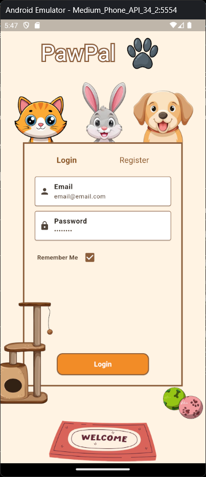
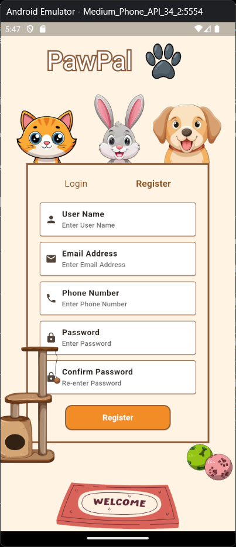
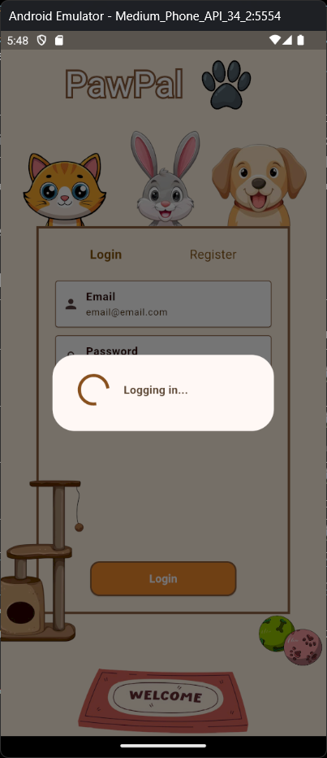
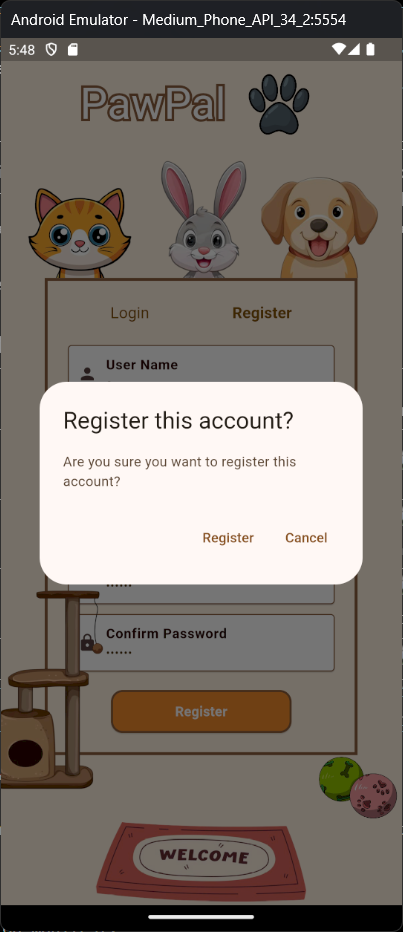
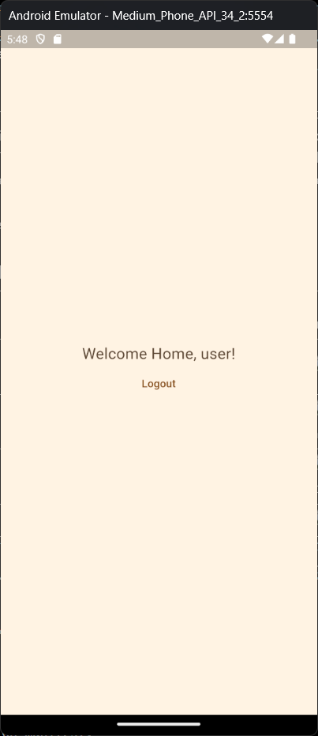
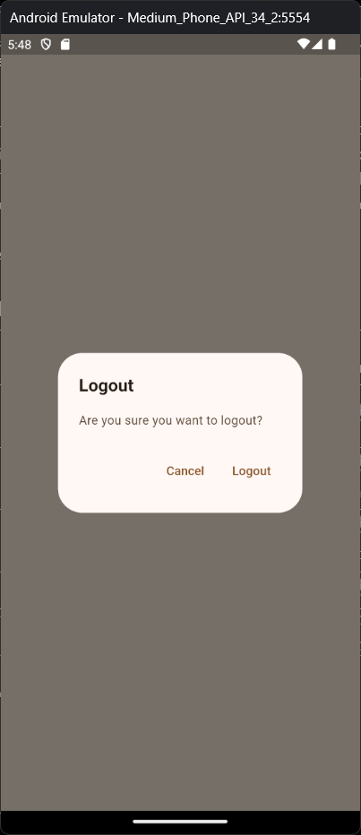

# app_pawpal

### **Description**

PawPal is a Flutter-based mobile application as a platform for pet adoption and donation. The application is still being developed and only covers the first module of the app, which is authentication. The system should allow users to create accounts and log in to the home screen.

## Module #1 Flow

1. **Launch App**

   - User launches the app and the **Authentication Screen**(Login and Register) is displayed.

2. **Login**

   - User is needed to enter registered email and password to successfully login to the home screen.
   - All fields use input formatters to only allow certain characters as input.
   - All inputs are validated using Regular Expressions.
   - Appropriate messages are displayed when invalid input is written.
   - Successful login will navigate user to the home screen.

3. **Register**

   - User needs to fill in the fields: username, email, password, confirm password, phone number to register.
   - All fields use input formatters to only allow certain characters as input.
   - All inputs are validated using Regular Expressions.
   - An existing email address cannot be used to register new account.
   - Appropriate messages are displayed when invalid input is written.
   - Successful registration will navigate user directly into the home screen.

4. **Remember Me Feature**

   - User is allowed to choose whether to store their login credentials saved for faster future login.

5. **Home Screen**

   - Home Screen displays **"Welcome back, {username}!"**
   - Logout button to return to authentication screen.

6. **Additional Features**
   - The app only allows for portrait views of the app.
   - Mobile devices' "back/return" button is disabled during some navigation process.

## Widgets Used

| Widget Name                 | Purpose                                                                          |
| --------------------------- | -------------------------------------------------------------------------------- |
| `Text`                      | Displays labels, messages, and text content                                      |
| `TextField`                 | Input field for searching places                                                 |
| `ElevatedButton`            | Button to close the detail screen                                                |
| `IconButton`                | Refresh button to reload places                                                  |
| `Row` / `Column`            | Layout structure for arranging widgets horizontally and vertically               |
| `Container`                 | Decorates UI elements and provides padding/margin                                |
| `SizedBox`                  | Adds spacing between widgets and sets height/width for certain widgets           |
| `ImageNetwork`              | Loads images from the internet and handles errors                                |
| `ListView.builder`          | Builds scrollable lists dynamically                                              |
| `Card`                      | Displays each place as a styled card                                             |
| `ListTile`                  | Displays place information inside a card with leading image, title, and subtitle |
| `InkWell`                   | Detects taps on the list items for navigation                                    |
| `Navigator`                 | Handles navigation between Home Screen and Detail Screen                         |
| `FocusManager`              | Unfocuses the search field when tapping outside                                  |
| `CircularProgressIndicator` | Shows loading spinner while fetching data                                        |

## Authorship Note

**Name: Mohamad Ridhwan Bin Mohamad Amin Chong**
**Matric Number: 294737**

“I confirm that this project represents my own original work in accordance with academic integrity policies. No part of the code was fully generated by AI tools such as ChatGPT or GitHub Copilot. I relied solely on lecture notes, class tutorials, and official Flutter documentation. I understand that my work may be scrutinized, and if it is found that I did not personally develop the code, marks may be deducted, or the submission may be disqualified.”

## Screenshots

| Screen          | Description                              | Image                                            |
| --------------- | ---------------------------------------- | ------------------------------------------------ |
| Login           | Authentication Screen with Login view    |            |
| Register        | Authentication Screen with Register view |      |
| Loading         | Loading Dialog                           |        |
| Register Dialog | Confirm register dialog                  |  |
| Home Screen     | Home Screen                              |       |
| Logout          | Logout Dialog                            |          |

## Link to GitHub Repository

https://github.com/RidhwanAC/app_pawpal
